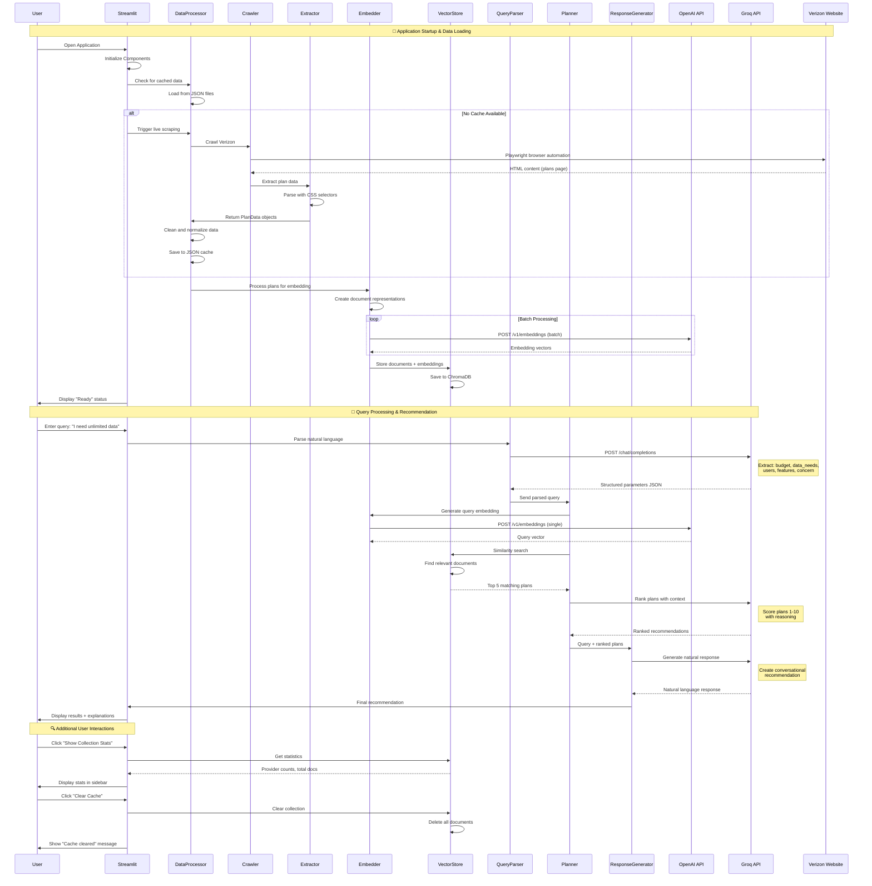
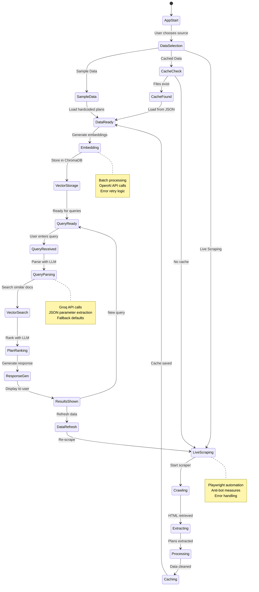
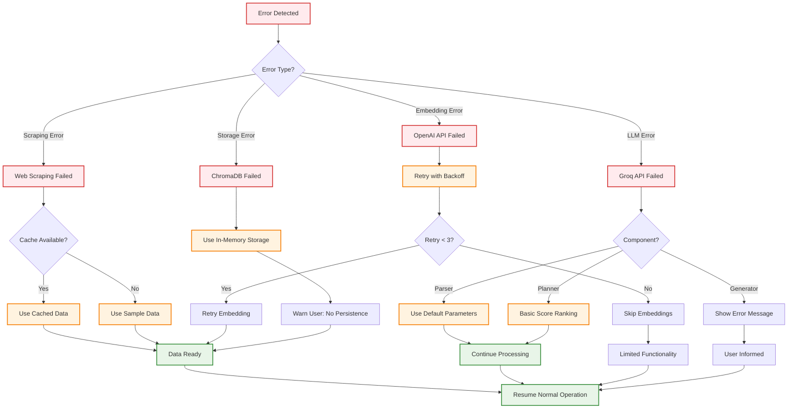

# Complete System Flow Diagram

## 🎯 **End-to-End User Journey Flow**

```mermaid
flowchart TD
    Start([User Opens App]) --> UI{Streamlit Interface}
    
    UI --> DataChoice{Choose Data Source}
    DataChoice -->|Sample Data| SampleData[Load Sample Plans]
    DataChoice -->|Live Scraping| LiveScrape[Trigger Web Scraping]
    DataChoice -->|Cached Data| CacheCheck[Check Cached Data]
    
    %% Live Scraping Flow
    LiveScrape --> Crawler[PlanCrawler]
    Crawler --> Browser{Use Playwright?}
    Browser -->|Yes| PlaywrightScrape[Playwright Browser Automation]
    Browser -->|No| RequestsScrape[Requests HTTP Client]
    
    PlaywrightScrape --> VerizonSite[Verizon Website]
    RequestsScrape --> VerizonSite
    VerizonSite --> HTMLContent[HTML Content]
    
    HTMLContent --> Extractor[PlanExtractor]
    Extractor --> ParseHTML[Parse with CSS Selectors]
    ParseHTML --> ExtractedData[Plan Data Objects]
    
    ExtractedData --> Processor[DataProcessor]
    Processor --> CleanData[Clean & Normalize Data]
    CleanData --> SaveCache[Save to JSON Cache]
    
    %% Cached Data Flow
    CacheCheck --> CacheExists{Cache Available?}
    CacheExists -->|Yes| LoadCache[Load from JSON Files]
    CacheExists -->|No| LiveScrape
    
    %% Sample Data Flow
    SampleData --> SamplePlans[Hardcoded Verizon Plans]
    
    %% Common Processing Path
    SaveCache --> ProcessedPlans[Processed Plan Data]
    LoadCache --> ProcessedPlans
    SamplePlans --> ProcessedPlans
    
    ProcessedPlans --> Embedder[PlanEmbedder]
    Embedder --> BatchProcess[Batch Process Plans]
    BatchProcess --> OpenAICall[Direct OpenAI API Call]
    OpenAICall --> Embeddings[Text Embeddings]
    
    Embeddings --> VectorStore[ChromaDB Vector Store]
    VectorStore --> StoredDocs[Stored Documents + Vectors]
    
    %% Query Processing Flow
    StoredDocs --> QueryInput[User Query Input]
    QueryInput --> QueryParser[QueryParser]
    QueryParser --> GroqAPI1[Groq API Call - Parse]
    GroqAPI1 --> ParsedQuery[Structured Query Parameters]
    
    ParsedQuery --> Planner[SimplePlanner]
    Planner --> SearchEmbedding[Generate Query Embedding]
    SearchEmbedding --> OpenAICall2[OpenAI API Call - Query]
    OpenAICall2 --> QueryVector[Query Embedding Vector]
    
    QueryVector --> VectorSearch[ChromaDB Similarity Search]
    VectorSearch --> RelevantDocs[Retrieved Relevant Documents]
    
    RelevantDocs --> RankPlans[Rank Plans with LLM]
    RankPlans --> GroqAPI2[Groq API Call - Rank]
    GroqAPI2 --> RankedPlans[Scored Plan Rankings]
    
    RankedPlans --> Generator[ResponseGenerator]
    Generator --> GroqAPI3[Groq API Call - Generate]
    GroqAPI3 --> FinalResponse[Natural Language Response]
    
    FinalResponse --> DisplayResults[Display Results to User]
    DisplayResults --> End([User Sees Recommendations])
    
    %% Error Handling
    Crawler -->|Error| FallbackSample[Fallback to Sample Data]
    OpenAICall -->|Error| EmbedError[Embedding Error]
    GroqAPI1 -->|Error| DefaultParams[Use Default Parameters]
    GroqAPI2 -->|Error| SimpleRank[Basic Ranking]
    GroqAPI3 -->|Error| ErrorResponse[Error Message]
    
    FallbackSample --> SamplePlans
    EmbedError --> RetryEmbed[Retry with Exponential Backoff]
    RetryEmbed --> OpenAICall
    
    %% Styling
    classDef userAction fill:#e3f2fd,stroke:#1976d2,stroke-width:2px
    classDef processing fill:#f3e5f5,stroke:#7b1fa2,stroke-width:2px
    classDef apiCall fill:#fff3e0,stroke:#f57c00,stroke-width:2px
    classDef storage fill:#e8f5e8,stroke:#388e3c,stroke-width:2px
    classDef error fill:#ffebee,stroke:#d32f2f,stroke-width:2px
    
    class Start,UI,QueryInput,DisplayResults,End userAction
    class Crawler,Extractor,Processor,Embedder,QueryParser,Planner,Generator processing
    class OpenAICall,OpenAICall2,GroqAPI1,GroqAPI2,GroqAPI3 apiCall
    class VectorStore,StoredDocs,SaveCache,LoadCache storage
    class FallbackSample,EmbedError,DefaultParams,SimpleRank,ErrorResponse error
```

## 🔄 **Detailed Component Interaction Flow**

## 📊 **Data State Transitions**

## 🔧 **Error Handling Flow**

## 🎯 **Key Architectural Improvements**

### **Eliminated Complex Dependencies**
- ❌ **LangChain**: Removed 15+ dependency packages
- ❌ **OpenAI Client**: Eliminated httpx/proxies conflicts  
- ❌ **Complex Chains**: Simplified to direct function calls

### **Enhanced Reliability**
- ✅ **Direct API Control**: Full control over HTTP requests
- ✅ **Comprehensive Error Handling**: Graceful degradation at every level
- ✅ **Multiple Fallback Strategies**: Sample data, cached data, retry logic
- ✅ **Robust Data Pipeline**: Validation and cleaning at each step

### **Improved Performance**
- ✅ **Batch Processing**: Efficient embedding generation
- ✅ **Persistent Storage**: ChromaDB with automatic fallback
- ✅ **Smart Caching**: Timestamp-based data freshness
- ✅ **Resource Management**: Memory-efficient processing

### **Production Ready**
- ✅ **Monitoring**: Comprehensive logging and statistics
- ✅ **Configuration**: Environment-based settings
- ✅ **Scalability**: Provider-independent architecture
- ✅ **Maintainability**: Clear separation of concerns

This updated architecture provides a robust foundation for the Telecom RAG system with direct API control, comprehensive error handling, and production-ready features.
