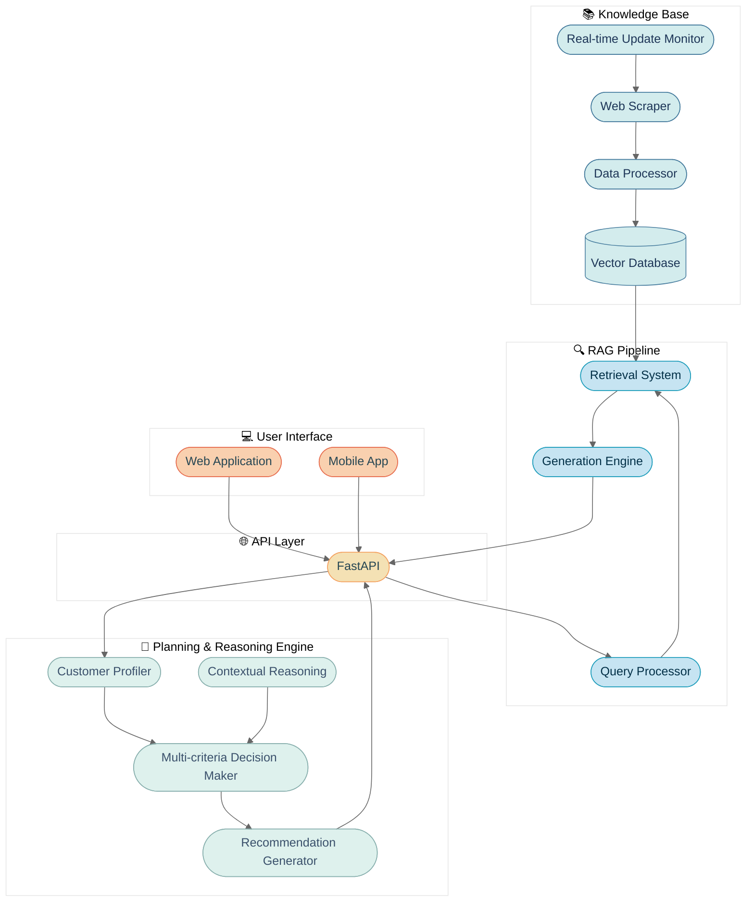

# System Architecture Overview

## High-Level Architecture

## Components
1. **Knowledge Base**: Collects, processes, and stores telecom plan information through web scraping, with vector embeddings for semantic search.
2. **RAG Pipeline**: Processes natural language queries, retrieves relevant context, and generates accurate responses.
3. **Planning & Reasoning Engine**: Analyzes customer needs, evaluates options, and provides personalized recommendations.
4. **API Layer**: FastAPI-based interface that connects all components and handles external requests.
5. **User Interface**: Web and mobile applications for customer interaction.

## Data Flow
1. Customer submits query through web/mobile interface
2. API layer processes request and routes to appropriate components
3. Query processor extracts intent and parameters
4. Retrieval system fetches relevant information from vector database
5. Planning engine evaluates options based on customer profile
6. Generation engine combines retrieved context with reasoning to create response
7. Response is returned to customer with explanations and recommendations

## Security Considerations
- End-to-end encryption for all customer communications
- Secure API authentication using JWT tokens
- PII anonymization in logs and analytics
- Regular security audits and penetration testing
- Compliance with telecom data regulations

## Scalability
- Horizontally scalable microservices architecture
- Asynchronous processing for compute-intensive operations
- Caching layer for frequent queries and responses
- Auto-scaling based on traffic patterns
- Distributed vector database with sharding capabilities