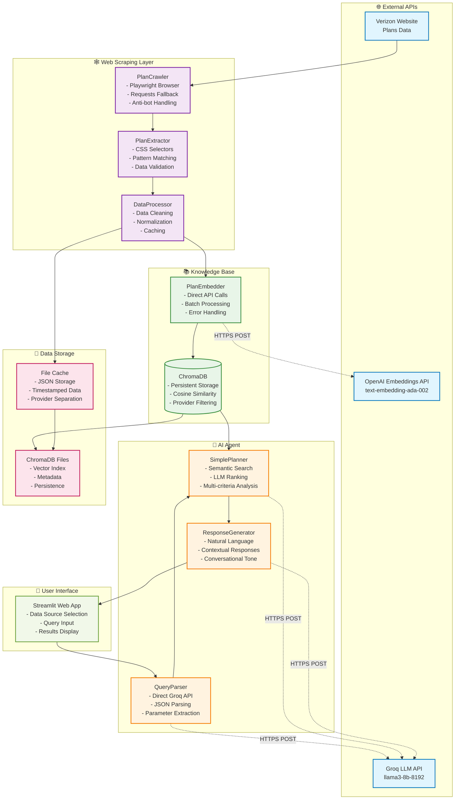
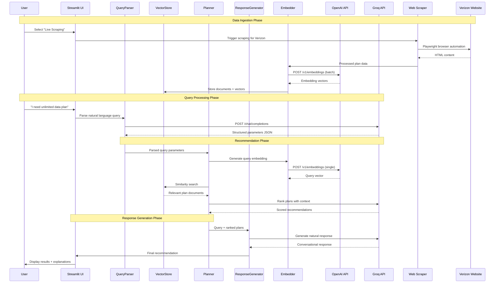

# Updated System Architecture & Flow Documentation

## 🏗️ **Current Architecture Overview**

The Telecom RAG Planning & Reasoning Agent has been significantly updated to use direct API calls and eliminate dependency conflicts. Here's the current system architecture:



## 🔄 **Updated Data Flow Diagram**



## 📋 **Architecture Components (Updated)**

### **1. Web Scraping Layer** 🕸️

#### **PlanCrawler** (Updated)
```python
# Current Implementation Highlights:
- Playwright for dynamic content (Verizon)
- Requests fallback for static sites
- Provider-specific configurations
- Anti-bot measures and timeouts
- Comprehensive error handling
```

**Key Features:**
- ✅ Asynchronous Playwright execution
- ✅ Multiple user agents and headers
- ✅ Configurable timeouts and retries
- ✅ Provider-specific scraping strategies

#### **PlanExtractor** (Enhanced)
```python
# Advanced Extraction Capabilities:
- Multiple CSS selector strategies
- Pattern-based text extraction
- Fallback parsing methods
- Robust data validation
```

**Extraction Strategy:**
1. **Primary**: CSS selectors for structured data
2. **Secondary**: Pattern matching for unstructured text
3. **Fallback**: Known plan name recognition

#### **DataProcessor** (Comprehensive)
```python
# Complete Pipeline:
- Data normalization and cleaning
- Price standardization ($XX/month)
- Feature deduplication
- JSON-based caching with timestamps
- Provider-specific data management
```

### **2. Knowledge Base Layer** 📚

#### **PlanEmbedder** (Rewritten)
```python
# Direct API Implementation:
- No OpenAI client dependency
- Direct HTTPS POST requests
- Batch processing (20 documents/request)
- Comprehensive error handling
- Timeout management
```

**API Call Structure:**
```json
{
  "model": "text-embedding-ada-002",
  "input": ["Plan text 1", "Plan text 2", "..."]
}
```

#### **VectorStore** (Enhanced)
```python
# ChromaDB Integration:
- PersistentClient with fallback
- Batch document processing
- Provider-based filtering
- Collection statistics
- Robust error handling
```

**Storage Features:**
- ✅ Persistent storage with automatic fallback
- ✅ Provider-based document management
- ✅ Efficient similarity search
- ✅ Collection statistics and monitoring

### **3. AI Agent Layer** 🤖

#### **QueryParser** (Direct API)
```python
# Groq API Integration:
- Direct HTTPS POST to Groq
- JSON-structured prompt templates
- Parameter extraction and validation
- Fallback to default values
```

**Query Processing:**
```json
{
  "budget": "under $80",
  "data_needs": "unlimited",
  "users": 1,
  "features": ["5G", "hotspot"],
  "primary_concern": "data"
}
```

#### **SimplePlanner** (LLM-Powered)
```python
# Advanced Planning:
- Semantic similarity search
- LLM-based plan ranking
- Multi-criteria decision making
- Detailed reasoning and explanations
```

**Ranking Output:**
```json
[
  {
    "plan_name": "5G Get More",
    "provider": "Verizon",
    "score": 8.5,
    "reasoning": "Excellent match for unlimited data needs...",
    "pros": ["30GB hotspot", "Premium features"],
    "cons": ["Higher price point"]
  }
]
```

#### **ResponseGenerator** (Conversational)
```python
# Natural Language Generation:
- Context-aware responses
- Conversational tone
- Detailed explanations
- Follow-up questions
```

## 🔧 **Technical Implementation Details**

### **API Integration Patterns**

#### **OpenAI Embeddings** (Direct)
```python
def embed_documents(self, texts: List[str]) -> List[List[float]]:
    for i in range(0, len(texts), batch_size):
        batch_texts = texts[i:i + batch_size]
        response = requests.post(
            "https://api.openai.com/v1/embeddings",
            headers={"Authorization": f"Bearer {api_key}"},
            json={"model": "text-embedding-ada-002", "input": batch_texts}
        )
        # Process response...
```

#### **Groq LLM** (Direct)
```python
def generate_response(self, prompt: str) -> str:
    response = requests.post(
        "https://api.groq.com/openai/v1/chat/completions",
        headers={"Authorization": f"Bearer {api_key}"},
        json={
            "model": "llama3-8b-8192",
            "messages": [{"role": "user", "content": prompt}]
        }
    )
    # Process response...
```

### **Data Flow Mechanisms**

#### **Caching Strategy**
```python
# File-based caching with timestamps
{
  "provider": "Verizon",
  "scraped_at": "2025-06-07T19:30:00",
  "plan_count": 4,
  "plans": [...]
}
```

#### **Vector Storage**
```python
# ChromaDB with metadata filtering
collection.add(
    embeddings=embeddings,
    documents=texts,
    metadatas=[{"provider": "Verizon", "name": "5G Get More"}],
    ids=["doc_20250607_193000_0"]
)
```

## 🎯 **Key Architecture Changes**

### **Eliminated Dependencies** ❌
- **LangChain**: Removed all LangChain imports and dependencies
- **OpenAI Client**: Replaced with direct API calls
- **Complex Chains**: Simplified to direct function calls

### **Added Direct Integrations** ✅
- **OpenAI Embeddings**: Direct HTTPS API calls
- **Groq LLM**: Direct HTTPS API calls  
- **ChromaDB**: Persistent client with fallback
- **Web Scraping**: Playwright + Requests hybrid

### **Enhanced Features** 🚀
- **Batch Processing**: Efficient embedding generation
- **Error Handling**: Comprehensive error recovery
- **Caching**: File-based data persistence
- **Monitoring**: Collection statistics and logging

## 📊 **Performance Characteristics**

### **Latency Breakdown**
- **Web Scraping**: 5-15 seconds (Verizon full site)
- **Embedding Generation**: 1-3 seconds (batch of 20)
- **Vector Search**: <100ms (5 results)
- **LLM Processing**: 1-2 seconds (Groq)
- **Total Query Time**: 2-5 seconds (cached data)

### **Scalability Features**
- **Batch Processing**: Handles large document sets
- **Provider Isolation**: Independent data management
- **Fallback Mechanisms**: Graceful degradation
- **Memory Management**: Efficient resource usage

## 🛠️ **Deployment Architecture**

### **Production Deployment**
```yaml
Services:
  - Streamlit App (Port 8501)
  - ChromaDB Persistent Storage
  - File Cache Directory
  - Log Management

External Dependencies:
  - OpenAI API (Embeddings)
  - Groq API (LLM Processing)
  - Target Websites (Scraping)

Storage Requirements:
  - ChromaDB: ~100MB per 1000 plans
  - File Cache: ~10MB per provider
  - Logs: ~1MB per day
```

### **Environment Variables**
```bash
OPENAI_API_KEY=sk-...
GROQ_API_KEY=gsk_...
LOG_LEVEL=INFO
CHROMA_PERSIST_DIRECTORY=./chroma_db
CACHE_DIRECTORY=./scraped_data
```

## 🔄 **Data Refresh Strategy**

### **Update Mechanisms**
1. **Manual Refresh**: User-triggered via UI
2. **Scheduled Updates**: Planned for production
3. **Cache Validation**: Timestamp-based freshness
4. **Fallback Data**: Sample plans when scraping fails

### **Data Consistency**
- **Vector Store**: Provider-based document management
- **File Cache**: Timestamped JSON files
- **Error Recovery**: Graceful fallback to cached data

This updated architecture provides a robust, scalable, and maintainable foundation for the Telecom RAG system with direct API control and comprehensive error handling.
